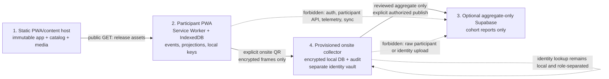

# GAMER-ICU Local-First Technical Design

## Context

The Kiro architecture assumes a Next.js server application with Supabase Auth, participant tables, participant APIs, signed media URLs, push subscriptions, and participant analytics. That conflicts with the approved study shape: participant study data stays on the participant device and leaves only through an explicit encrypted QR collection session at an approved onsite location. Supabase receives only genuinely non-identifiable cohort aggregates after local collection and disclosure review.

The learner contract remains: an installable mobile-first PWA for the 90-day curriculum, with Lake Mucosa, Interlobar Divides, Valley of Pulmonara, Bronchial Bluffs, Mount Pneumora, and Alveolar Highlands; video, reading/graphic, quiz, clinical case vignette, quest, and ventilator-lab activities; local PEEP Points, streaks, progression, final-exam gates, daily completion limits, anonymous feedback, and accessible operation from 320 pixels upward.

The repository uses Next 16.1.6, React 19.2.3, TypeScript, Tailwind, Framer Motion, Zustand, Vitest, and fast-check. `@supabase/ssr` and `@supabase/supabase-js` are remnants of the superseded Kiro plan, not participant-runtime dependencies. Browser IndexedDB, Service Worker, Web Crypto, WebAuthn platform authenticators, and storage APIs are preferred over new state, crypto, or caching frameworks.

The non-negotiable invariant is:

> No participant-level, pseudonymous, transfer, device, exact-time, or linkable study value is sent from the participant PWA to Supabase or another reporting service. Participant records leave the device only in the participant-controlled encrypted QR exchange with an authorized institution collector.

## Goals and Non-Goals

### Goals

- Deliver a static installable PWA that enrolls and teaches offline after its shell and a complete content release load.
- Replace cloud identity and participant APIs with local enrollment, a versioned IndexedDB event log, and transactionally maintained projections.
- Preserve cumulative island unlocks on days 0/31/61, previously unlocked islands, the unrounded 80% final-exam gate, and the configured daily cap on new completions.
- Preserve first-completion PEEP Points, repeat practice, seven-day streak bonuses, four quiz interactions, content validation/fallback, clinical cases, quests, Vent Lab, accessibility, and no leaderboard.
- Provide an authenticated, confidential, bounded, resumable, idempotent QR transfer with signed collector acknowledgement.
- Provide an institution-provisioned collector with encrypted local participant storage, separated identity linkage, least-privilege roles, audit, backup/recovery, retention, deletion, and an aggregate-only publication gate.
- Preserve development, preview, production, collector-provisioning, onsite-acceptance, and operational handoff.

### Non-Goals

- No name, email, password, cloud account, Supabase Auth session, participant login, participant-specific server route, cloud participant backup, participant analytics, push subscription, or background synchronization.
- No participant rows/events, codes, encrypted participant blobs, exact individual timestamps, device identifiers, or identity mappings in Supabase.
- No researcher participant drill-down, participant leaderboard, stable cross-report pseudonym, or participant context on feedback links.
- No QR transfer of curriculum media; media is static versioned content, not study-data collection.
- No clinical-content change merely to preserve the old backend shape. Quest secrets are not learner-readable content and are not a cloud password API.

## Decisions

### 1. Four trust zones and allowed flows



1. **Static PWA/content host:** Next is built as `output: 'export'` and served as immutable public assets with PR previews and a production deployment. It exposes a signed release manifest, validated catalog, and packaged media only. There are no participant routes, cookies, sessions, API writes, analytics beacons, push services, or participant server runtime. The Service Worker caches public assets only.
2. **Participant PWA:** The browser owns enrollment, activity state, attempts, points, streaks, progression, export state, and local cryptographic keys. It may issue public GETs for a release/content asset, but participant code, avatar, anchor, events, projections, responses, transfer state, keys, and device data are absent from URLs, bodies, headers, cookies, telemetry, and service-worker requests. QR is the only participant-data egress.
3. **Optional aggregate-only Supabase:** The project contains only an aggregate publication schema and boundary. The participant app has no Supabase credentials. An authorized collector explicitly submits a reviewed, disclosure-safe, idempotent aggregate snapshot. A public asset mirror is allowed only as read-only asset delivery; the default release uses the static host.
4. **Provisioned collector:** A separately packaged local collector scans offline, decrypts/validates frames, imports into an encrypted local participant database, signs acknowledgements, derives cohort reports, and retains participant records locally. A distinct protected identity vault maps code to direct identity only for a separately authorized role. The vault is never joined to study rows, audit payloads, reports, or Supabase payloads.

The PWA-to-collector link is optical and local; network availability never changes the boundary.

### 2. Static release, catalog, and media

The release manifest binds `appRelease`, `protocolVersion`, `localSchemaVersion`, `contentVersion`, study identifier, trusted study signing key, and SHA-256 hashes for the catalog and each packaged media asset. Build-time validation rejects invalid island, stable activity ID, type, ordering, metadata, or type-specific payload. The catalog includes all six islands and configured activities in order. A malformed or missing activity remains visible as unavailable/Coming Soon and cannot produce completion or PEEP Points.

Renderers consume the local versioned catalog rather than content APIs. Quiz attempts and unfinished activity state retain the `contentVersion`; a new release never scores an old attempt against changed answers. Quest content contains instructions and supervisor role only. Supervisor confirmation uses separately provisioned supervisor-only validation material bound to activity/content version; no validation secret is learner-readable or sent to Supabase.

The Service Worker stages a candidate release separately, verifies its manifest and required asset hashes, then activates it only when complete. Until then the last complete release remains active. IndexedDB updates use supported non-destructive migrations; unknown, corrupt, interrupted, or unsafe migrations fail closed without creating an empty participant. Local reminders are shown on launch/resume; no notification permission, Web Push subscription, or participant-specific push is created.

### 3. Local enrollment and participant state

Enrollment is a durable local state machine:

`unstarted -> codeAccepted -> missionComplete -> avatarSelected -> enrolled`

The participant supplies only an institution-issued non-identifying study code. A bounded local validator rejects empty/malformed values without remote lookup. A valid code is retained locally, the cinematic mission introduction must finish, and an astronaut/rocket or other themed avatar must be selected. The final transaction records one enrollment anchor, avatar, `enrolled` state, and day-zero date basis. Reloading an incomplete flow resumes it; a completed flow reuses its anchor and never creates a replacement. A failed write never claims enrollment and never transmits a retry.

The `gamer-icu-study` IndexedDB database has an explicit schema version but is only an encrypted vault, never a key vault. IndexedDB may expose only a random opaque `vaultId`, schema/algorithm version, an opaque platform-credential reference, random storage references, non-sensitive migration markers, nonces, ciphertext, authentication tags, and integrity metadata. Participant code, enrollment/profile, event identities and payloads, projections, drafts, transfer/acknowledgement state, envelope material, and keys are persisted only as authenticated-encrypted values. The logical stores are:

- `metadata`: encrypted study configuration, bounded local code, avatar, enrollment state/anchor, release versions, last accepted clock observation, and export policy.
- `events`: encrypted immutable accepted events keyed by an encrypted random `eventId`, monotonic `eventSequence`, event type, activity ID when applicable, content version, bounded payload, device-reported time and unverified basis, and commit metadata. Validation rejects names, medical-record/encounter IDs, contact details, patient identifiers, and free-text intended to identify a person. SBAR responses are bounded to their activity schema and reject prohibited identifiers.
- `projections`: encrypted enrollment/profile, unique completion set, island status, point contributors/total, streak, daily cap, and aggregate-export eligibility. Projections derive from events and are never independently uploaded.
- `drafts`: encrypted resumable quiz/activity work preserving randomized order, responses, feedback, and content version without making an unfinished attempt a completion.
- `transfers`: encrypted explicit export snapshots, accepted offer identity (`offerId`, `collectorSessionId`, `collectorTransferKeyId`, and accepted `offerStatusSequence`), stable `sourceIdentityId`, concrete `sourceKeyId`, event sequence range, bootstrap/envelope digests, frame state, offer/transfer/acknowledgement state, and recoverable failures. It contains no raw transfer private key.
- `keys`: only encrypted trust metadata and opaque platform-protected key handles; it never stores a raw private key, registration-proof secret, data key, wrapping key, or persisted `CryptoKey` object.

Participant plaintext exists only transiently in the validated repository operation. Each persisted value is an AES-256-GCM record with a fresh nonce and additional authenticated data binding the vault, logical store, opaque record reference, schema version, and study/protocol version. The repository never places plaintext values, derived state, transfer payloads, key bytes, or decrypted QR data in logs, caches, crash reports, temporary files, ordinary backups, or export staging. A transaction may update several encrypted records, but IndexedDB receives ciphertext only; the repository decrypts and validates before applying the event/projection invariant and reads back authenticated ciphertext before reporting success.

Participant data is enabled only after a prototype-gated platform custody adapter passes on every supported browser/OS/install mode. The required prototype path is a platform-authenticator-backed WebAuthn PRF credential created with user verification: the credential secret remains in the platform authenticator, PRF output is used only in memory to derive an AES-256-GCM wrapping key with HKDF-SHA-256, and the adapter wraps a random per-vault data key. IndexedDB may retain only the opaque credential reference, random wrap nonce/AAD, and the AEAD-wrapped data-key blob; that blob is ciphertext, not a usable key. Raw wrapping/data/signing private-key bytes and no usable encryption key are ever persisted beside participant ciphertext. A platform-resident signing-key handle is preferred; if the prototype must wrap signing material, it uses the same platform wrapping key and never stores the raw key.

The prototype must exercise creation, reopen, reload, credential/user-verification denial, platform/browser support detection, key loss, wrapped-key corruption, ciphertext corruption, and interrupted writes. A missing/denied/unsupported platform authenticator or PRF, unavailable key handle, invalid wrap tag/AAD, modified or truncated ciphertext, unknown custody/schema metadata, or failed read-back enters an observable `key-unavailable` or `storage-integrity` state and blocks open, decrypt, read, mutate, export, acknowledge, delete, reset, and replacement-store creation. Encrypted material remains intact for approved recovery; there is no same-IndexedDB `CryptoKey` fallback, plaintext/volatile fallback, automatic new credential, or empty replacement participant.

An accepted event and every affected projection update are one IndexedDB transaction. Stable `eventId` makes local retries idempotent; when exported, institution-wide deduplication uses `(studyId, sourceIdentityId, eventId)` and checks `eventSequence` plus the canonical event-payload digest (`eventPayloadSha256`); a different valid ID remains distinct. The repository reads back event and projection before reporting success. Abort, quota, read-back mismatch, corruption, or read-only storage leaves the last committed state visible and reports a recoverable error; it never falls back to volatile state or silently resets the participant.

`navigator.storage.estimate()` and `navigator.storage.persist()` are best-effort controls, not guarantees. Public media and participant data have separate budgets. If storage is insufficient, optional media may be deferred, but an event that cannot be durably committed is stopped and explained.

### 4. Local domain behavior

Pure local modules replace server modules; UI reads projections through Zustand or a repository hook, and the repository is the only writer.

- **Dashboard/progression:** show all six islands, local avatar/label, streak, and PEEP Points. Islands 1–2 unlock days 0–30, 3–4 days 31–60, and 5–6 days 61–90; an unlocked island remains open. An unrounded unique-completion ratio of at least 80% unlocks its final exam; invalid/empty catalog leaves it locked. A daily cap blocks only new credit; repeat practice does not add points, progress, streak, or cap usage. Locked states are visible, non-interactive, and announced as unavailable. No leaderboard appears.
- **Activities:** the library exposes every valid activity's title, type, time, points, order, and local completion. Video waits for its completion condition; reading/graphic requires one valid confirmation question. Quiz supports MCQ, drag/drop, matching, and fill-in-the-blank, randomizes valid questions/options while preserving associations, gives immediate feedback, and computes `floor(activityPoints * correct / validQuestionCount)`. Cases require content-defined decisions and complete SBAR. Vent Lab validates controls and preserves progress locally. Quest requires offline supervisor confirmation. Invalid content never completes.
- **Gamification:** first accepted completion awards its configured value once; zero-value activities still complete; repeats do not award. Streak engagement advances once per calendar day, resets after a missed day, and awards one bonus per seven-day cycle. Contributors, total, completion, streak, and daily-cap changes commit together.
- **Time basis:** enrollment-day, streak, and cap calculations record device-clock observations and visibly label them device-reported/unverified. A backward/inconsistent jump preserves committed state, leaves prior unlocks open, withholds new time-based effects, and shows a clock-integrity warning. Missing time makes dependent results unavailable; it never fabricates a date.
- **Feedback:** an explicit dashboard action opens an anonymous form without code, avatar, progress, scores, events, or other participant context.

### 5. Replacement of the Supabase architecture

| Kiro path | Local-first replacement | Removal/boundary |
|---|---|---|
| Name/email/password registration, Supabase Auth, JWT middleware | Local study-code enrollment and local route guards | Remove credential auth, `src/modules/auth` cloud service, auth APIs, middleware, sessions, and participant cookies |
| `users`, `user_progress`, `user_streaks`, `quiz_attempts`, `user_daily_activity` | IndexedDB immutable events plus projections/drafts | No participant tables, RLS, participant writes, or participant reads in Supabase |
| `islands`/`activities` queries and signed media URLs | Build-validated immutable catalog and packaged/static media | No participant content API or signed-URL dependency |
| Progression, gamification, quiz, analytics route handlers | Pure local functions and transactional repository | Remove `/api/progression`, `/api/gamification`, `/api/quiz`, participant analytics, and cloud retry queues |
| Researcher user metrics and participant exports | Collector-local cohort aggregation, suppression, and approved aggregate export | No drill-down, one-row-per-participant export, or identity-linked report |
| `push_subscriptions` and edge reminders | Local in-app reminders | No push permission, subscription, or participant notification service |
| Vercel SSR/server deployment | Static Next export with preview/production assets | Retain public hosting/CI; remove participant runtime and participant analytics |

After all callers migrate, Supabase dependencies can leave the participant bundle and `package.json`; any collector aggregate adapter is a separate build boundary. No compatibility shim retains a participant cloud path.

### 6. QR transfer protocol

#### 6.1 Pairing and trust

A provisioned collector creates a short-lived `Offer` QR. The offer is usable only with the institution's trusted root and a fresh status observation; a collector signature alone is not an authorization to collect. The exact signature-excluded offer body is:

```text
OfferBody {
  protocolVersion, studyId, collectionPointId, collectorId,
  collectorIdentityKeyId, offerId, collectorSessionId,
  collectorTransferKeyId, collectorEphemeralEcdhPublicKey,
  acknowledgementKeyId, acknowledgementVerificationPublicKey,
  supportedContentVersions, maxFrames, maxChunkBytes,
  offerPurpose: standard,
  issuedAt, expiresAt, maxFreshnessAgeSeconds,
  offerStatusEpoch, offerStatusSequence: 0, offerState: active
}

Offer = OfferBody {
  institutionAuthorizationSignature,
  offerSignature
}
```

`institutionAuthorizationSignature` is an institution-root ECDSA signature over the domain-separated preimage `UTF8("gamer-icu/qr/v1/offer/institution") || 0x00 || canonical(OfferBody)`, and `offerSignature` is the provisioned collector-identity ECDSA signature over `UTF8("gamer-icu/qr/v1/offer/collector") || 0x00 || canonical(OfferBody)`. `offerId` is a fresh 16-byte random value, `collectorSessionId` and `collectorTransferKeyId` identify one collector session and its exact ephemeral ECDH key, and none of those identities may be reused. `offerStatusEpoch` is issued by the institution status authority and is not a participant-device clock. The root public key, allowed key IDs, maximum offer age, and maximum freshness age are pinned in the approved release.

The first-install ceremony is a separate registration transcript, not an export and not an `Offer` with `offerPurpose:firstRegistration`. A genuinely empty installation MUST complete it before any ordinary `Offer` with `offerPurpose:standard` is accepted. Registration objects contain no enrollment, activity, event, projection, envelope, bootstrap, frame, or acknowledgement data; an unknown member or any attempted activity payload is rejected by the canonical profile.

```text
RegistrationOfferBody {
  protocolVersion, studyId, collectionPointId,
  collectorId, collectorIdentityKeyId, institutionRootKeyId,
  registrationOfferId, registrationChallenge,
  registrationFreshnessEpoch, registrationFreshnessCounter,
  issuedAt, expiresAt, maxFreshnessAgeSeconds,
  registrationState: active
}

RegistrationOffer = RegistrationOfferBody {
  institutionRegistrationOfferSignature
}

RegistrationRequestBody {
  protocolVersion, studyId, collectionPointId,
  collectorId, collectorIdentityKeyId,
  registrationOfferId, registrationRequestId,
  registrationChallenge, proofPurpose: firstRegistration,
  sourceKeyId, sourcePublicKey
}

RegistrationRequest = RegistrationRequestBody {
  sourceProofSignature
}

RegistrationReceiptBody {
  protocolVersion, studyId, collectionPointId,
  collectorId, collectorIdentityKeyId, authoritativeLedgerKeyId,
  registrationOfferId, registrationRequestId, registrationReceiptId,
  registrationFreshnessEpoch, registrationFreshnessCounter,
  sourceIdentityId, sourceKeyId, sourcePublicKey,
  registrationLedgerSequence, registrationState: registered,
  issuedAt
}

RegistrationReceipt = RegistrationReceiptBody {
  registrationReceiptDigest,
  collectorRegistrationSignature,
  authoritativeLedgerSignature
}
```

The registration offer is at most 4,096 canonical bytes, carries a fresh 32-byte `registrationChallenge`, and is root-signed with `UTF8("gamer-icu/qr/v1/registration-offer/institution") || 0x00 || canonical(RegistrationOfferBody)`. Its `registrationFreshnessEpoch` and monotonic `registrationFreshnessCounter` come from the institution authority; the signed lifetime is no greater than `maxFreshnessAgeSeconds`, and the participant never uses its wall clock to authorize it. `registrationOfferId` and `registrationRequestId` are fresh 16-byte values, `sourceKeyId` and assigned `sourceIdentityId` are 16-byte values, `sourcePublicKey` is a 65-byte SEC1 uncompressed P-256 point, and every P-256 signature is 64-byte IEEE P1363.

The participant generates or recovers its installation signing key under the approved custody gate, verifies the root signature, exact study/site/collector scope, active state, freshness epoch/counter, bounded lifetime, and local single-use state, then creates a request at most 4,096 canonical bytes. `sourceProofSignature` covers `UTF8("gamer-icu/qr/v1/registration-request/participant") || 0x00 || canonical(RegistrationRequestBody)` and proves possession of the exact `sourcePublicKey` named by `sourceKeyId`. The collector and authoritative ledger verify the request, ensure the request/offer IDs and challenge match exactly, and reject an already-used request with different bytes or any source-key mismatch.

The collector asks the authoritative ledger to assign `sourceIdentityId` to the `(studyId, sourceKeyId, sourcePublicKey)` lineage and receives a receipt at most 8,192 canonical bytes. `registrationReceiptDigest = SHA-256(canonical(RegistrationReceiptBody))`; `collectorRegistrationSignature` covers `UTF8("gamer-icu/qr/v1/registration-receipt/collector") || 0x00 || canonical(RegistrationReceiptBody)`, and `authoritativeLedgerSignature` covers `UTF8("gamer-icu/qr/v1/registration-receipt/ledger") || 0x00 || canonical(RegistrationReceiptBody)`. The participant verifies both signatures, the digest, exact offer/request/challenge/freshness/source-key/study bindings, active lineage state, and the monotonic ledger sequence, then durably stores the complete receipt and read-back result before it may accept a newly issued normal `Offer` with `offerPurpose:standard`. Registration receipt replay is idempotent only for the exact same bytes and existing lineage; a different assignment, request, key, study, or offer fails closed and never transfers an activity record.

On reinstall, an intact encrypted vault and recoverable installation key/handle retain the stored receipt; a collector or ledger may look up that exact receipt by `registrationReceiptId` or `(studyId, sourceKeyId, sourcePublicKey)` and return only registration metadata, never participant events. A missing key or receipt blocks export rather than guessing an identity or creating a replacement store. A new empty installation performs a new ceremony and receives a new source identity. An authorized signed old-to-new `KeyTransition` retains the same `sourceIdentityId`; a revoked/lost old key requires institution-signed revocation and a fresh physical registration, and cannot resume old pending transfers. Replayed registration offers, requests, or receipts, mismatched `sourcePublicKey`/`sourceKeyId`, stale freshness, and cross-study/site/collector bindings fail closed without export, acknowledgement, deletion, or lineage mutation.

The collector also provides a signed `OfferStatus` and a root-signed freshness observation. The exact status body is:

```text
OfferStatusBody {
  protocolVersion, studyId, collectionPointId, collectorId,
  collectorIdentityKeyId, offerId, collectorSessionId,
  collectorTransferKeyId, offerStatusEpoch, offerStatusSequence,
  offerState: active|canceled|revoked|consumed,
  statusReason, issuedAt, expiresAt
}

OfferStatus = OfferStatusBody {
  statusSignature,
  institutionStatusSignature
}
```

`statusSignature` is the collector signature over `UTF8("gamer-icu/qr/v1/offer-status/collector") || 0x00 || canonical(OfferStatusBody)` and `institutionStatusSignature` is the institution-root signature over `UTF8("gamer-icu/qr/v1/offer-status/institution") || 0x00 || canonical(OfferStatusBody)`; neither signature field is included. Status sequence is strictly increasing within an epoch. An older `active` status therefore cannot overwrite a received terminal status, but sequence alone cannot prove that a newer status was not withheld.

The approved freshness/time rule is institution-authoritative collector time: the managed collector obtains a current root-signed `FreshnessBody` from the institution time/status authority (or an institution-approved hardware-backed monotonic time service) after the participant supplies a fresh challenge nonce:

```text
FreshnessBody {
  protocolVersion, studyId, collectionPointId, collectorId,
  collectorSessionId, offerId, offerStatusEpoch, freshnessNonce,
  authoritativeNow, freshnessExpiresAt, freshnessCounter,
  latestOfferStatusSequence, latestOfferState
}

Freshness = FreshnessBody { institutionFreshnessSignature }
```

The root signature covers `UTF8("gamer-icu/qr/v1/freshness/institution") || 0x00 || canonical(FreshnessBody)`. `authoritativeNow` and `freshnessExpiresAt` are institution-authoritative UTC values, `freshnessCounter` is monotonic for the registered collector/time authority, and the signed lifetime is no greater than the pinned `maxFreshnessAgeSeconds`. The participant never compares these values with its wall clock. It accepts freshness only when the nonce matches this collection attempt, the root signature and epoch validate, the counter is not older than the last accepted counter for that authority, the latest status sequence/state agrees with the presented offer/status, and the institution-approved monotonic lifetime has not elapsed. A new offer, app restart, resume after an unbounded interruption, or missing/ambiguous/expired/unverifiable freshness evidence requires a new observation; otherwise collection fails closed before bootstrap or frame emission. A collector may work without a network after obtaining this evidence, but only until its signed lifetime. This explicitly bounds, rather than eliminates, offline revocation latency: a revocation not yet propagated to the authority/status evidence can remain usable only within the configured freshness/offer lifetime, and no implementation may claim immediate offline revocation.

The participant scans and verifies the offer and freshness evidence, exact study/site scope, collector identity and transfer-key binding, root and collector signatures, supported versions and limits, status epoch/sequence/state, and local replay/consumption state. It visibly shows the authorized collection point and offer identity and requires participant selection of that session. On acceptance it durably records `(offerId, collectorSessionId, collectorTransferKeyId, offerStatusEpoch, offerStatusSequence, freshnessCounter)` as the accepted offer identity. A status rollback, a status sequence/state older than the freshness observation, a canceled/revoked/consumed offer, an offer already bound to another transfer, or an offer outside its signed age fails closed. No participant record is prepared or frame emitted until all checks pass.

#### 6.2 Envelope, framing, and standards-based crypto

Every protocol object is a JSON object accepted only in the canonical profile below. `canonical(x)` returns bytes, not a JSON object: it validates `x`, serializes it exactly once, and encodes the result as UTF-8 without a BOM. Objects have no duplicate or unknown members. Object members are ordered by ascending UTF-16 code-unit lexicographic order of their names (the order used by RFC 8785/JCS); arrays retain their schema order. No insignificant whitespace is emitted. Strings must be valid Unicode scalar sequences, must already be NFC-normalized, and must not contain unpaired surrogates; a receiver rejects a non-NFC or invalid string rather than normalizing a received value. A quote and reverse solidus are escaped as `\"` and `\\`; every other U+0000 through U+001F character is escaped as lowercase `\u00xx`; all other scalars are emitted as their UTF-8 characters. Protocol numbers are only non-negative integers no larger than `9007199254740991`; their wire spelling is base-10 digits with no leading zero, sign, decimal point, exponent, or `-0`. RFC3339 UTC timestamps with seconds and `Z` are strings, not numbers. `null` is forbidden: an optional value is omitted, and an empty list/object or explicit enum value is used when the schema requires presence. A received JSON text is accepted only if its bytes equal `canonical(parsedObject)`, so alternate escaping, member order, number spelling, or whitespace is not silently repaired.

Every binary, key, digest, nonce, ciphertext, chunk, and signature field is the unpadded base64url encoding (`A-Z`, `a-z`, `0-9`, `-`, `_`, no `=`) of the exact raw bytes. Random `offerId`, `collectorSessionId`, `transferId`, `sourceIdentityId`, `sourceKeyId`, `registrationOfferId`, `registrationRequestId`, `registrationReceiptId`, `registrationChallenge`, `freshnessNonce`, and stable `eventId` values are 16-byte binary registry values except the 32-byte registration challenge; SHA-256 digests (`payloadSha256`, `bootstrapDigest`, `envelopeDigest`, `registrationReceiptDigest`, `eventLedgerReceiptDigest`, `eventSetDigest`, and event payload digests) are 32 bytes; `hkdfSalt` is 32 bytes; an AES-GCM nonce is 12 bytes and its tag is the final 16 bytes of `ciphertextAndGcmTag`; and an HMAC-SHA-256 value is 32 bytes. P-256 public keys (`collectorEphemeralEcdhPublicKey`, `participantEphemeralPublicKey`, `sourceSigningPublicKey`, `sourcePublicKey`, and `acknowledgementVerificationPublicKey`) are SEC1 uncompressed points, exactly 65 bytes beginning with `0x04`. ECDSA P-256/SHA-256 signatures (offer, registration, status, freshness, bootstrap, source, missing-status, ledger-receipt, and acknowledgement signatures) are IEEE P1363 `r || s`, exactly 64 bytes, never DER. Other key IDs and human-facing study/site labels are bounded NFC strings; if any such key ID is a binary registry value it follows the same unpadded base64url rule. A field whose declared binary length, alphabet, or padding is wrong is rejected before cryptographic processing.

All signatures use explicit domain separation: `sign(domain, body) = UTF8(domain) || 0x00 || canonical(body)`, where `0x00` is exactly one zero byte. The fixed domains are exactly `gamer-icu/qr/v1/offer/institution`, `gamer-icu/qr/v1/offer/collector`, `gamer-icu/qr/v1/offer-status/collector`, `gamer-icu/qr/v1/offer-status/institution`, `gamer-icu/qr/v1/freshness/institution`, `gamer-icu/qr/v1/bootstrap/participant`, `gamer-icu/qr/v1/envelope/source`, `gamer-icu/qr/v1/registration-offer/institution`, `gamer-icu/qr/v1/registration-request/participant`, `gamer-icu/qr/v1/registration-receipt/collector`, `gamer-icu/qr/v1/registration-receipt/ledger`, `gamer-icu/qr/v1/missing-frame-status/collector`, `gamer-icu/qr/v1/event-ledger-receipt/ledger`, and `gamer-icu/qr/v1/acknowledgement/collector`. HMAC inputs remain exactly `canonical(body)` and are not domain-prefixed.

The canonical wire-size limits are 4,096 bytes for `RegistrationOffer`, `RegistrationRequest`, and `Bootstrap`, 8,192 bytes for `RegistrationReceipt`, `MissingFrameStatus`, `EventLedgerReceipt`, and `Acknowledgement`, 4,096 frames per transfer, 1,024 decoded bytes per frame chunk, and 4,096 events per receipt. A bitmap has exactly `ceil(count/8)` bytes (at most 512 bytes at these bounds); unused high bits are zero. Key IDs and labels are at most 64 NFC characters, and a bounded index list contains at most 4,096 sorted unique zero-based indexes.

The participant creates a fresh ephemeral P-256 ECDH pair, 32-byte `hkdfSalt`, and 16-byte `transferId` for each transfer. It constructs:

```text
HkdfInfoObject {
  purpose: "gamer-icu/qr/v1",
  protocolVersion, studyId, collectionPointId, offerPurpose,
  offerId, collectorSessionId, collectorTransferKeyId,
  offerStatusEpoch, appRelease, contentVersion,
  transferId, sourceIdentityId, sourceKeyId
}
```

`hkdfInfo` is the unpadded base64url encoding of `canonical(HkdfInfoObject)`. With the accepted collector public key, `sharedSecret = ECDH(participantEphemeralPrivate, collectorEphemeralPublic)`, `prk = HKDF-Extract(hkdfSalt, sharedSecret)`, `aesKey = HKDF-Expand(prk, hkdfInfoBytes || 0x00 || UTF8("envelope"), 32)`, and `frameHmacKey = HKDF-Expand(prk, hkdfInfoBytes || 0x00 || UTF8("frame-hmac"), 32)`. The literal `0x00` is one zero byte and the labels are exactly the shown lowercase UTF-8 bytes.

For interoperability, implementations MUST include these fixed vectors in protocol acceptance evidence:

| Input | Required bytes/result |
|---|---|
| `canonical({"a":1,"b":"é"})` | UTF-8 hex `7b2261223a312c2262223a22c3a9227d`; SHA-256 hex `09ad9fd2fb648cb2f62141215828ea00a62c299db05d20aa9ade2f527a301cc6` |
| `base64url(00 ff 10)` | `AP8Q` (never `AP8Q=`) |
| `canonical({"chunkBase64url":"AQI","chunkLength":2,"frameCount":1,"frameIndex":0})` with 32 zero key | UTF-8 hex `7b226368756e6b42617365363475726c223a22415149222c226368756e6b4c656e677468223a322c226672616d65436f756e74223a312c226672616d65496e646578223a307d`; HMAC-SHA-256 hex `d2f6170171d8e28f1f1865d85451926017be50872cb81a483f55f334757bc0bc` |

For deterministic registration/resume/receipt checking, the approved fixture uses the body values in the named schemas with `protocolVersion:"qr-v1"`, `studyId:"study-demo"`, `collectionPointId:"point-a"`, `collectorId:"collector-1"`, `collectorIdentityKeyId:"collector-key-1"`, `registrationOfferId=base64url(00..0f)`, `registrationRequestId=base64url(10..1f)`, `sourceKeyId=base64url(20..2f)`, the P-256 generator point as `sourcePublicKey`, `registrationChallenge=base64url(40..5f)`, and `proofPurpose:"firstRegistration"`: `SHA-256(canonical(RegistrationRequestBody)) = f2ff0e4485344b5e700e108f2dafa987872ea72efba822b89b822318c5c1f7d2`. With `offerId=base64url(00..0f)`, `collectorSessionId=base64url(10..1f)`, `collectorTransferKeyId:"ctk-1"`, `transferId=base64url(20..2f)`, all-zero `bootstrapDigest`, all-0x11 `envelopeDigest`, `statusSequence:3`, `frameCount:4`, `missingFrameIndexes:[1,3]`, `freshnessEpoch:7`, and `freshnessCounter:9`, `SHA-256(canonical(MissingFrameStatusBody)) = ed5f7c4da7bfae449ff3dd35ae2bd16a44a60ac529abaca66aad0687c2485507`. For two events `(eventId=base64url(40..4f),eventSequence:1,eventPayloadSha256=base64url(22×32))` and `(eventId=base64url(50..5f),eventSequence:2,eventPayloadSha256=base64url(33×32))` in that order, `SHA-256(canonical(eventSetList)) = f95e7beb3477bd774450cacfc8a2819f350fc10dcb06908757da4f153a3688cd`; with `eventCount:2`, `outcomeEncoding:"importedBitOneDuplicateBitZeroLsbFirst"`, `outcomeBitmap=base64url(01)`, and the other named body fixture values, `SHA-256(canonical(EventLedgerReceiptBody)) = 01526d84258f6245d2ed212a24a110543c0f0fa380bfb99f0335c6224d855c39`. Domain-separated signing bytes are exactly the corresponding ASCII domain, one `00`, then those canonical body bytes.

Before any data frame is displayed, the participant emits one signed, non-secret `Bootstrap`. Its exact signature-excluded body is:

```text
BootstrapBody {
  protocolVersion, studyId, collectionPointId,
  offerId, collectorSessionId, collectorTransferKeyId, transferId,
  offerPurpose, offerStatusEpoch, offerStatusSequence,
  offerState: accepted, replayState: firstUse,
  sourceIdentityId, sourceKeyId, sourceSigningPublicKey,
  participantEphemeralPublicKey, hkdfSalt, hkdfInfo
}

Bootstrap = BootstrapBody { bootstrapSignature }
```

The participant signs `UTF8("gamer-icu/qr/v1/bootstrap/participant") || 0x00 || canonical(BootstrapBody)` with its persistent installation key; `bootstrapDigest = SHA-256(canonical(BootstrapBody))`. The collector validates the accepted offer/freshness tuple, stable institution-issued `sourceIdentityId`, and presented concrete `sourceKeyId`/`sourceSigningPublicKey` against the authorized source-key lineage and transition state, then verifies the signature, exact canonical `hkdfInfo`, key/field sizes, and digest before deriving `frameHmacKey`. The bootstrap exposes only public key-agreement inputs and contains no participant record or private key.

The exact authenticated manifest is:

```text
Manifest {
  protocolVersion, studyId, collectionPointId,
  offerId, collectorSessionId, collectorTransferKeyId, transferId,
  offerPurpose, offerStatusEpoch, offerStatusSequence,
  offerState: accepted, replayState: firstUse,
  appRelease, contentVersion, sourceIdentityId, sourceKeyId,
  eventSequenceStart, eventSequenceEnd, eventCount,
  deviceTimeBasis, payloadSha256, bootstrapDigest,
  participantEphemeralPublicKey, hkdfSalt, hkdfInfo
}
```

The plaintext payload is a bounded object `{enrollment, events, projectionContributors}` with no direct identity; `events` are sorted by `eventSequence` and each event carries its stable `eventId`, `eventSequence`, and `eventPayloadSha256`. `plaintextBytes = canonical(payloadObject)` and `payloadSha256 = SHA-256(plaintextBytes)`. The exact GCM AAD is `aadBytes = canonical(Manifest)`—not the outer envelope, frame, or any signature. With a fresh nonce, `ciphertextAndGcmTag = AES-256-GCM-Encrypt(aesKey, nonce, plaintextBytes, aadBytes)`.

The exact envelope body and wire object are:

```text
EnvelopeBody {
  manifest, nonce, ciphertextAndGcmTag
}

Envelope = EnvelopeBody {
  envelopeDigest, sourceSignature
}
```

`Envelope` is the flat JSON object containing the three `EnvelopeBody` members plus `envelopeDigest` and `sourceSignature`; `EnvelopeBody` is the exact object `{manifest, nonce, ciphertextAndGcmTag}` used for digest/signature, not a second serializer or an implementation-defined view. `envelopeDigest = SHA-256(canonical(EnvelopeBody))`; `sourceSignature` covers `UTF8("gamer-icu/qr/v1/envelope/source") || 0x00 || canonical(EnvelopeBody)` with no digest or signature field included. The envelope is transmitted as `canonical(Envelope)` bytes, and those bytes are divided into chunks. The collector reconstructs and parses the one canonical envelope, recomputes `envelopeDigest`, verifies `sourceSignature` against the authorized public key for the presented `sourceKeyId` in the source lineage, and rejects any alternate serialization.

Each data QR is a flat `Frame` object. Its exact MAC-excluded body is:

```text
FrameBody {
  protocolVersion, studyId, collectionPointId,
  offerId, collectorSessionId, collectorTransferKeyId,
  transferId, sourceIdentityId, sourceKeyId,
  offerStatusEpoch, bootstrapDigest, envelopeDigest,
  frameIndex, frameCount, chunkLength, chunkBase64url
}

Frame = FrameBody { frameHmacSha256 }
```

The collector returns a signed `MissingFrameStatus` after a valid partial transfer:

```text
MissingFrameStatusBody {
  protocolVersion, studyId, collectionPointId,
  collectorIdentityKeyId, offerId, collectorSessionId,
  collectorTransferKeyId, transferId,
  bootstrapDigest, envelopeDigest,
  statusState: incomplete|complete|expired|rejected,
  statusSequence, frameCount,
  missingEncoding: indexes|bitmap,
  missingFrameIndexes | missingFrameBitmap,
  freshnessEpoch, freshnessCounter
}

MissingFrameStatus = MissingFrameStatusBody {
  statusSignature
}
```

Exactly one of `missingFrameIndexes` and `missingFrameBitmap` is present. `missingFrameIndexes` is a sorted, unique, zero-based list no longer than `frameCount`; `missingFrameBitmap` is exactly `ceil(frameCount/8)` bytes with bit `i` (least-significant bit first) indicating missing frame `i`, and unused bits are zero. A status is at most 8,192 canonical bytes, `frameCount` is 1–4,096, `statusSequence` starts at zero and strictly increases for the exact offer/session/transfer/bootstrap/envelope tuple, and `statusSignature` covers `UTF8("gamer-icu/qr/v1/missing-frame-status/collector") || 0x00 || canonical(MissingFrameStatusBody)`. The status's `freshnessEpoch` and `freshnessCounter` MUST equal the currently accepted root-signed freshness evidence; `statusState:incomplete` is the only state that authorizes resend.

`frameHmacSha256 = HMAC-SHA-256(frameHmacKey, canonical(FrameBody))`. `frameIndex` is zero-based, `frameCount` is positive, `chunkLength` is the decoded byte length, and the initial bound is at most 4,096 frames and 1,024 bytes of envelope bytes per frame. The collector rejects a frame until the matching bootstrap and freshness evidence pass; then it validates canonical encoding, bounds, identity, count, length, HMAC, and both digests before storing it. Any order is allowed, but a conflicting same-position frame fails without replacing the accepted position. Frames contain no plaintext participant record, direct identifier, or private key.

#### 6.3 Resume, import, and acknowledgement

The participant commits a transfer snapshot in encrypted `transfers` storage before any bootstrap or frame and retains source events. Its visible states are `offerSeen`, `offerAccepted`, `preparing`, `sending`, `recoverablyIncomplete`, `awaitingAcknowledgement`, `acknowledged`, `retentionEligible`, `canceled`, `rejected`, `keyUnavailable`, and `storageIntegrity`. The UI shows only collection point, accepted offer identity, frame progress, and a recoverable reason. A phone lock, app close, or collector interruption produces `recoverablyIncomplete`; a participant cancellation, signed cancellation/revocation, expiry, or replay is terminal. Resuming requires a newly validated freshness observation; otherwise no frame is emitted.

The collector durably records the accepted offer tuple, stable `sourceIdentityId`, presented concrete `sourceKeyId`, transfer ID, bootstrap digest, envelope digest, freshness counter, and frame positions in one encrypted transaction. A repeated identical frame is ignored; a same-position conflict is audited and fails closed. The collector's offer/transfer ledger permits one offer to bind to one transfer and an active transfer to resume only with that exact tuple. A second transfer ID, different envelope digest, mismatched `sourceIdentityId`/`sourceKeyId`, stale status epoch/sequence, or terminal offer fails closed.

The collector durably advances the status sequence before displaying a status. The participant verifies the collector key, signature, exact protocol/study/site/offer/session/collector-transfer-key/transfer/bootstrap/envelope binding, state, frame count, sorted/unique bounds, bitmap length and unused bits, and equality with its accepted freshness epoch/counter. A byte-identical repeated status is ignored; a lower or equal sequence with different bytes, changed missing positions, tampered digest, stale freshness, wrong transfer, or replayed terminal state fails closed. The participant resends only the requested positions and never emits an unrequested or newly generated frame; no status can change source records or import state.

Every imported event is also checked against one institution-wide source-event ledger shared by all approved collectors and included in encrypted backup/restore. The registry assigns a stable institution-issued `sourceIdentityId` to the participant's source-key lineage; each concrete rotatable signing key has a separately recorded and verified `sourceKeyId`. The deduplication identity is exactly `(studyId, sourceIdentityId, eventId)`. The ledger records `sourceKeyId`, `eventSequence`, and `eventPayloadSha256 = SHA-256(canonical(eventPayload))` as conflict checks. An event with the same deduplication identity, sequence, and payload digest is an idempotent duplicate even when an authorized signed key rotation changes `sourceKeyId`, or when it arrives in a new offer, transfer ID, envelope, collector database, or restored backup. Reuse of the same deduplication identity with a different sequence or digest is a hard conflict: the whole candidate import is rejected, the conflict is locally audited, no acknowledgement is issued, and existing records are not replaced. An unknown, expired, revoked, or lineage-mismatched `sourceKeyId` is rejected even when its `sourceIdentityId` is known. The ledger commit and event/projection import are atomic, so overlapping collectors and restores cannot double-count an event or award points twice.

After all frames are present, the collector validates the complete canonical envelope, recomputes its digest, verifies the source signature, decrypts/authenticates AAD, checks versions/schema/sequence/hash/no-identifier rules, applies the institution-wide ledger, and imports only once. An exact repeat returns the original import result; a conflict or rejected event remains rejected and receives no acknowledgement. Only after durable import or an exact previously recorded duplicate does it construct the compact ledger receipt and sign an acknowledgement.

```text
EventLedgerReceiptBody {
  protocolVersion, studyId, collectionPointId,
  sourceIdentityId, sourceKeyId,
  offerId, collectorSessionId, collectorTransferKeyId,
  transferId, envelopeDigest,
  importTransactionId, ledgerSequence,
  eventCount, eventSetDigest,
  outcomeEncoding: importedBitOneDuplicateBitZeroLsbFirst,
  outcomeBitmap, ledgerReceiptKeyId
}

EventLedgerReceipt = EventLedgerReceiptBody {
  eventLedgerReceiptDigest,
  eventLedgerReceiptSignature
}
```

`eventSetList` is the participant-known canonical ordered array of objects `{eventId,eventSequence,eventPayloadSha256}` in the exact exported event order (strictly increasing `eventSequence`). `eventSetDigest = SHA-256(canonical(eventSetList))`. `eventCount` is 0–4,096; `outcomeBitmap` has exactly `ceil(eventCount/8)` bytes, with bit `i` set to 1 only when event `i` was imported and 0 only when it was an institution-ledger duplicate, least-significant bit first. No conflict, validation rejection, sequence/digest mismatch, or partial import may be encoded as a bitmap outcome or acknowledged. `eventLedgerReceiptDigest = SHA-256(canonical(EventLedgerReceiptBody))`, and `eventLedgerReceiptSignature` covers `UTF8("gamer-icu/qr/v1/event-ledger-receipt/ledger") || 0x00 || canonical(EventLedgerReceiptBody)` using the signed `ledgerReceiptKeyId`.

Its exact signature-excluded acknowledgement body is:

```text
AcknowledgementBody {
  protocolVersion, studyId, collectionPointId,
  offerId, collectorSessionId, collectorTransferKeyId, transferId,
  sourceIdentityId, sourceKeyId, envelopeDigest,
  eventLedgerReceiptDigest, eventLedgerReceipt,
  importResult: imported|duplicate,
  offerStatusEpoch, offerStatusSequence, offerState: consumed,
  acknowledgementKeyId, issuedAt
}

Acknowledgement = AcknowledgementBody { acknowledgementSignature }
```

The nested receipt object and its signature are transported inside the signed acknowledgement; `eventLedgerReceiptDigest` MUST equal the nested `eventLedgerReceipt.eventLedgerReceiptDigest`. `importResult` is `imported` when at least one receipt bit is 1 and `duplicate` only when all bits are 0. `acknowledgementSignature` covers `UTF8("gamer-icu/qr/v1/acknowledgement/collector") || 0x00 || canonical(AcknowledgementBody)`. Before moving to `acknowledged` or any policy-approved `retentionEligible` state, the participant verifies the collector signature, exact tuple/digest/source/epoch/status binding, nested receipt digest/signature/key, event-set digest, count, and every bit against its participant-known event list. Missing, invalid, stale, conflict, rejected, replayed, or mismatched acknowledgements preserve source events and encrypted transfer state; no deletion follows an unverified response.

#### 6.4 Key lifecycle

The institution holds the study root signing key offline; only its public key is distributed in approved releases. Each collector is provisioned with a revocable, expiring identity signing key, a distinct per-session `collectorTransferKeyId`/ECDH key, acknowledgement-verification key, and access to the institution status/time authority. Provisioning records exact key IDs, collection point, supported versions, validity interval, roles, `offerStatusEpoch`, freshness policy, and signed revocations. Collector private keys use the managed workstation's OS keychain or encrypted keystore; a revoked, expired, unprovisioned, or mismatched collector key cannot offer, scan, import, or acknowledge.

After the custody prototype passes on a first install/enrollment, the participant generates one persistent P-256 ECDSA installation key and random `sourceKeyId` for the concrete signing key. The first approved onsite enrollment uses the distinct root-signed `RegistrationOffer` -> participant `RegistrationRequest` -> collector/ledger `RegistrationReceipt` ceremony defined above, not an export `Offer` or status and never any activity payload. The institution registry assigns its stable institution-issued `sourceIdentityId` for the participant's source-key lineage and records that `sourceKeyId`, public key, proof-of-possession request, and registration receipt. No ordinary transfer is accepted until that lineage entry exists and the receipt is durably read back.

An app update or ordinary reload preserves the registered `sourceIdentityId` and currently authorized `sourceKeyId`. A reinstall may continue only if the encrypted vault and protected key handle/credential are recovered; if participant data exists but the signing key cannot be recovered, the participant remains in `keyUnavailable` and no new key, export, acknowledgement, delete, or replacement store is permitted. A genuinely empty new install creates a new key and requires a fresh first-registration ceremony; it cannot resume an old offer or transfer.

An intentional rotation while the old key is available uses a participant-signed `KeyTransition` containing the stable `sourceIdentityId`, old/new `sourceKeyId` and public keys, predecessor digest, and old/new signatures. The collector verifies the old registry entry, new-key possession, institution authorization, validity, and revocation state before appending the new key to the same source identity. The event uniqueness key never changes during this transition, so old and new keys cannot create duplicate or conflicting lineages. If the old key is unavailable, only institution-signed revocation plus a fresh physical registration may establish a new source identity; it cannot resume pending old-key transfers.

For ordinary bootstrap and envelope, the collector compares the presented `sourceKeyId` and public-key bytes with the authorized key in the `sourceIdentityId` lineage, including any valid signed transition, and checks revocation and expiry before deriving HMAC keys or retaining a frame. Unknown `sourceIdentityId`, `sourceKeyId`/public-key mismatch, invalid registration/transition signature, stale freshness/status receipt, revoked key, or continuity break fail closed, record only a minimized security audit event, preserve participant ciphertext, and issue no import or acknowledgement. Key rotation does not rewrite old import/acknowledgement records. Transfer private material remains only while required for the active transaction and is then removed from ordinary storage.
### 7. Collector storage, identity separation, and reporting

The collector uses authenticated encrypted SQLite/SQLCipher (or an institution-approved equivalent) with its key in the OS keychain. Participant rows, encrypted partial frames, local import state, acknowledgement status, and transfer metadata stay there. Plaintext temporary files, ordinary exports, browser caches, and logs are prohibited; staging files are encrypted and deleted. There is no background sync, participant cloud backup, or collector-to-Supabase participant route.

Each study has one authoritative institution-local reporting/import/disclosure ledger. The institution controls its encryption keys, backups, access policy, and audit trail. Authorized collectors and disconnected scan stations are contributors to that ledger, not independent reporting authorities: a contribution is ineligible for reporting until the authoritative ledger has accepted and consolidated it. The ledger retains the source-key lineage registry (`sourceIdentityId` with authorized `sourceKeyId` transition/revocation state), source-event identity, `eventSequence`, `eventPayloadSha256`, transfer/envelope digest, signed contribution and receipt records, import/restore decisions, eligible-population membership, immutable input-set versions, aggregate snapshot records, and suppression/differencing decisions. Participant records and these source-level ledgers remain institution-local and never enter Supabase.

For every validated contribution, the ledger verifies the stable institution-issued `sourceIdentityId`, presented concrete `sourceKeyId`, and source signature against that lineage's authorized key/transition state, then enforces the exact institution-wide deduplication identity `(studyId, sourceIdentityId, eventId)`. It records `eventSequence` and `eventPayloadSha256 = SHA-256(canonical(eventPayload))` for conflict checks. A repeated deduplication identity with matching sequence and payload digest is one already-known event and is not counted again, even when an authorized rotation changes `sourceKeyId` or the event arrives through another transfer, collector, backup restore, or retry. The same deduplication identity with a different sequence or digest is a conflict and is rejected/quarantined rather than replacing the accepted event; unknown, expired, revoked, or mismatched `sourceIdentityId`/`sourceKeyId` values are rejected. Collector-local deduplication is only a prefilter and never overrides the authoritative ledger.

If a scan station cannot reach the authoritative ledger, an authorized operator may perform offline consolidation only through an institution-controlled encrypted bundle or managed removable medium. The station signs the canonical contribution manifest and encrypts the contribution for the ledger; the ledger verifies the station registration, signature, bundle sequence, `sourceIdentityId`/`sourceKeyId` lineage status, and source-event identity, sequence, and digest tuples before one atomic import. It issues a signed receipt containing the contribution digest, ledger identity/version, accepted and rejected/conflict counts, and reconciliation status without exposing participant content. Replayed, tampered, forked, or conflicting bundles and stale restores are rejected or quarantined, and a restore cannot clear or reset prior deduplication decisions. A station with no signed ledger receipt cannot mark records eligible, produce a report, export a report, or publish.

The identity vault is a separate encrypted database/key and role policy. Coded records contain the study code but no name/contact; the vault contains code-to-identity mapping only for an authorized linkage role. Collection operators scan/import/acknowledge but cannot browse unrestricted records or use the vault. Researchers see aggregates only. Separate roles protect collection, research, linkage, backup/recovery, retention/deletion, and configuration. Sessions expire. Audit entries contain actor, action, target category, time, and result, not record contents, direct identity, or raw QR payload.

Aggregation uses only records accepted by the authoritative ledger as validated, durably imported, acknowledgement-eligible, and members of one approved cohort/population and reporting period. It can produce cohort counts/rates/distributions for PEEP Points, streaks, time, quiz outcomes, and island completion, never a participant value or row. It removes codes, event IDs, source keys, exact timestamps, device metadata, free text, and stable person-specific ordering before view/export/queue/publication. The ledger freezes the authoritative eligible-population digest and input-set digest for each snapshot.

The authoritative ledger owns snapshot identity and release decisions. A snapshot ID is derived from canonical approved `(study, cohort, period, metric definition, report version, eligiblePopulationDigest, inputSetDigest)` values, never participant identity. An exact repeat of that descriptor and payload is idempotent; an existing snapshot ID with a different population, input set, metric, version, or payload is a conflict and is rejected rather than overwritten. A newly consolidated event set creates a new snapshot identity instead of mutating a released snapshot.

One atomic, persistent suppression/differencing ledger in the authoritative reporting ledger governs every researcher view, export, offline handoff, and publication. It records canonical released/suppressed cells and the approved query/population/snapshot scope, detects complements, subsets, repeated periods, and cross-collector combinations, and preserves the decision across retries, restores, and views. A collector cannot release a cell without an authoritative ledger decision and signed release receipt, so separate collectors cannot publish complementary cells or bypass suppression by publishing independently. If that ledger is unavailable or has a conflict, the operation fails closed.

The publication gateway validates the complete payload against the authoritative snapshot and signed release receipt before transmission and rejects participant IDs/codes, direct identifiers, pseudonyms, stable link keys, one-row-per-participant data, raw events, encrypted envelopes, exact timestamps, device values, free text, identity mappings, source/event/digest fields, and partial payloads. It records rejection locally and sends nothing. An approved aggregate may be reviewed/exported offline; an authorized operator explicitly publishes only that already-approved non-linkable snapshot and safe publication metadata to aggregate-only Supabase. Raw data, source-level digests, and pending participant queues are never sent or queued. If Supabase is unavailable, the snapshot and release decision remain in the authoritative local ledger.

### 8. Testing and verification design

Use the existing Vitest/fast-check approach for pure TypeScript, plus browser/device and collector acceptance tests for storage, camera, crypto, and offline lifecycle.

- **Domain properties:** invalid enrollment; unlock windows and persistence; clock rollback; unique completion percentages; inclusive 80% gate; daily cap; transactional points/streak invariants; retry idempotence; quiz permutations/associations/scoring; content contracts/fallback; quest supervisor requirement; Vent Lab bounds.
- **IndexedDB and custody contracts:** commit/read-back, abort atomicity, stable event replay, interrupted/unknown migration, corrupt/read-only/quota storage, reload/offline recovery, draft resume, and every export state. The browser/OS matrix must prove the WebAuthn-PRF platform custody adapter on each supported install mode, prove no usable key/plaintext in IndexedDB or other durable artifacts, and exercise unsupported/denied authenticator, key loss, wrap-tag corruption, ciphertext corruption, and recovery preservation. Instrument `fetch`, service-worker requests, URLs, headers, cookies, and telemetry to assert no participant values are emitted.
- **Protocol vectors:** offer signature/scope/expiry/status-sequence, signed cancellation/revocation/consumption, offer replay and second-transfer rejection, first-install participant-key registration, reinstall continuity, signed key transition, key mismatch/revocation, bootstrap signature and exact HKDF inputs, tampered participant ephemeral key/salt/info/digest, first out-of-order frame authentication before frame zero, tampered AAD/ciphertext/source signature, truncation, duplicate/conflicting frames, unsupported/downgraded versions, replay, concurrent import, interruption/resume, invalid acknowledgement, and exact acknowledgement/offer-state binding. Fixed byte vectors permit independent checking.
- **Collector security:** encrypted-at-rest inspection, no plaintext temp/log artifacts, role/session and participant-key-registry matrix, first-registration and rotation/revocation ceremonies, identity-vault isolation, offline import, backup/restore idempotence, pre-ack deletion gate, audit minimization, aggregate rejection, low-cell/differencing suppression, and no raw-data egress.
- **Content/PWA:** complete six-island release and every renderer, offline install/launch, network loss, missing media, 320/375/414 pixel layouts, keyboard/screen reader, WCAG AA, staged update rollback, and existing-data migration.
- **Synthetic end-to-end:** local enrollment -> custody gate/key registration -> mission/avatar -> dashboard -> activities -> points/streak/progression/exam -> offline reload -> offer validation/participant confirmation -> signed bootstrap -> arbitrary out-of-order frame -> interruption/resume -> signed acknowledgement/consumed offer -> idempotent replay rejection -> aggregate -> suppression/approval -> explicit publication. Preview and production use synthetic codes/events for these tests.

The release-blocking privacy test is that a participant run with instrumented network performs only public asset GETs, and a collector publication attempt emits only the validated aggregate schema.

## Risks and Trade-offs

| Risk/trade-off | Containment |
|---|---|
| Browser storage eviction/quota and iOS persistence vary. | Request persistent storage, preflight capacity, separate participant/media budgets, stage updates, and never report success without read-back. No volatile/cloud fallback. |
| Browser/platform key-custody capability varies or a platform authenticator is unavailable. | Prototype the WebAuthn-PRF protected wrapping-key adapter on every supported browser/OS/install mode before enabling participant data; unsupported, denied, lost, or corrupted custody fails closed with encrypted material preserved. Never fall back to same-IndexedDB keys, plaintext, volatile state, or a replacement store. |
| Device clocks are user-controlled and cannot establish QR offer freshness. | Device-clock time remains labeled/untrusted for local progression; QR collection uses only the institution-root-signed bounded-age freshness/status evidence and an approved authoritative monotonic rule. Missing, stale, ambiguous, regressed, or unverifiable evidence fails closed before bootstrap or frame emission. |
| QR is slower and event history may exceed camera capacity. | Bounded authenticated frames, exact canonical object/byte boundaries, fixed base64url encodings and interoperability vectors, resumable batches, no media transfer, explicit confirmation, and reject oversize data rather than truncate. |
| Offline status/revocation evidence may be stale. | Root-sign the offer authorization, status epoch/sequence, and freshness observation; require the latest status evidence and bounded TTL, document the resulting maximum offline revocation latency, and require a fresh observation after expiry or restart. Never imply zero-latency offline revocation. |
| Device/collector loss or key damage can cause a replacement envelope. | Retain until verified acknowledgement, encrypt DB/backups, use OS key custody, retain import decisions, rotate/revoke keys, and enforce institution-wide `(studyId, sourceIdentityId, eventId)` plus canonical payload digest/sequence uniqueness across collectors and restores. |
| Participant signing-key continuity breaks across reinstall, rotation, or compromise. | Preserve the protected key/vault, require a signed old-to-new transition that keeps the stable source identity when possible, require institution-signed revocation plus fresh physical registration when not, and reject mismatched/revoked keys and pending old-key transfers. |
| Codes may be reused or indirectly identifying. | Keep bounded codes local to the participant/collector boundary, omit them from reports/Supabase, and restrict local linkage. |
| Re-identification by small cells/repeated queries. | Approved minimum-cell setting, persistent suppression, differencing checks, no stable person key, and fail-closed publication. |
| Updates can mix versions or break data. | Bind app/content/protocol/schema versions, validate/stage complete releases, retain last working release, and use non-destructive migrations. |
| Offline collection has operational burden. | Provision/accept collectors, train operators, require bounded-age status/freshness evidence before every offer/resume, support status/ack, retain pending state, test recovery, and publish aggregates later without raw queues. |

### Unresolved protocol and operational assumptions

These named assumptions require study/institution sign-off; until resolved, affected operations fail closed rather than guess.

1. **IRB/protocol:** consent and IRB must define code linkage, authorized roles, retention/deletion for participant data/backups/incomplete transfers, collection points, permitted metrics and periods, minimum cell/differencing rules, and whether Supabase publication is allowed. Collector import requires provisioning; aggregate display/publication requires approved reporting configuration.
2. **Device clock:** it is unresolved whether enrollment-day, daily-cap, and streak decisions use device date alone or a trusted onsite observation. Until decided, device time is unverified and anomalies cannot grant unlocks/bonuses or reset committed state.
3. **Storage eviction:** supported browser/OS versions, quota/persistent-storage behavior, reserved participant capacity, and participant export/recovery cadence are unresolved. Until device testing establishes them, preflight storage, keep media optional where possible, and stop safely on quota/read failures.
4. **Media size:** the largest video/complete offline pack and whether all or selected media must be offline are unresolved. QR never carries media; release acceptance measures the pack and uses unavailable-media behavior for optional assets that do not fit.
5. **Collection frequency:** the approved interval and maximum retained event volume between onsite collections are unresolved. Collection never starts automatically; the app retains committed records and allows explicit bounded batches while collector capacity and retention rules are enforced.
6. **Protected-key capability:** the supported browser/OS/install matrix must first demonstrate WebAuthn PRF, user-verification behavior, stable credential recovery, wrapping/unwrap integrity, and explicit failure signals. Until that prototype evidence is accepted, enrollment/open/export/acknowledgement are disabled on that target; same-IndexedDB key custody is not an interim implementation.
7. **QR freshness authority:** the institution must approve the root/status authority, collector time/monotonic implementation, challenge flow, maximum offer/freshness age, status epoch propagation, and the resulting bounded offline revocation latency. Until that evidence and configuration are present, the participant cannot accept an offer, bootstrap, emit a frame, or resume collection.
8. **Participant-key ceremony:** the institution must approve the first-registration proof/code-matching ceremony, receipt retention, rotation authority, and revocation evidence. Until configured, the collector accepts no participant `sourceIdentityId`/`sourceKeyId` lineage registration and the participant retains records without acknowledgement.

## Migration Plan

### Phase 1 — Establish the replacement boundary

1. Freeze OpenSpec requirements and map each Kiro route/table/module/task to its local-first replacement. Add study/protocol/content/version manifests and an egress deny-list.
2. Configure static export and release manifests. Remove participant SSR/API assumptions, cloud auth middleware, participant analytics, push subscriptions, and server-side quest secrets. Keep React, Tailwind, Framer Motion, Zustand, Vitest, fast-check, mobile shell, and public previews.
3. Create local domain interfaces and the encrypted IndexedDB vault before moving UI callers: schema versions/migrations, allowlists, reducers, stable IDs, transaction/read-back, storage errors, clock observations, explicit export states, and the prototype-gated WebAuthn-PRF platform custody adapter. Do not enable participant data on a browser/OS/install mode until the adapter proves protected wrapping-key behavior and fail-closed key/ciphertext handling.

### Phase 2 — Rebuild learner behavior locally

1. Implement offline enrollment, mission/avatar flow, anchor, local guards, dashboard/HUD, six-island map, accessibility states, local reminders, and anonymous feedback.
2. Implement validated catalog/static media packaging and populate all islands/activity types; retain unavailable-content behavior for invalid records.
3. Port progression, gamification, quiz, case, quest, and Vent Lab into pure local modules. Tie attempts/completions to app/content versions and commit events/projections atomically. Verify schedule, exam threshold, cap, points, streaks, and retries.
4. Stage Service Worker updates and safe IndexedDB migrations; confirm interrupted/incompatible releases leave the prior release and local data usable.

### Phase 3 — Implement collection

1. Define the versioned QR protocol and fixed crypto vectors, including canonical signed offers/status, offer cancellation/revocation/consumption/replay state, accepted offer identity, first-install participant-key registration, reinstall continuity, signed key transitions, revocation, the signed per-transfer bootstrap, exact HKDF inputs, envelope digest, first out-of-order frame authentication, P-256 ECDH/HKDF/AES-GCM envelopes, ECDSA source signatures, HMAC frames, bounded batches, resume, validation, idempotent import, signed status, and acknowledgement.
2. Package the collector with encrypted participant storage, participant `sourceIdentityId`/`sourceKeyId` lineage registry and receipts, rotation/revocation workflow, separate identity vault, OS key custody, roles/sessions, audit minimization, backup/restore, retention/deletion, aggregation, suppression/differencing, and publication gateway. Keep raw data/identity mappings offline.
3. Exercise wrong collector, invalid/canceled/replayed/mismatched offers, first out-of-order frame after bootstrap, bootstrap/HKDF/signature tampering, duplicates, interruption, unsupported versions, invalid acknowledgement, replay/concurrency, source-key reinstall/rotation/revocation, storage/custody failure, and backup recovery with synthetic data.

### Phase 4 — Development and preview

Each pull request builds a uniquely named static app/content release and runs planned OpenSpec validation, lint, unit/property, browser integration, privacy-egress, content-schema, accessibility, and static-build checks. Preview deployments use isolated keys/configuration and synthetic data, cannot publish to production Supabase, and use a separate study ID/trust root. Review inspects the manifest, network allowlist, removal of participant APIs, and complete offline learner journey.

### Phase 5 — Production release

An approved source commit creates a reproducible static export, signed manifest, validated catalog, hashed media, Service Worker, and release artifact. CI records app/content/protocol/schema versions and hashes, then publishes to the production static host only after preview acceptance. The last known-good release remains available for rollback; rollback never erases IndexedDB. Deployment logs contain release metadata only and participant analytics remain disabled.

Production acceptance uses supported Android/iOS devices and retained-data upgrades: pass the browser/OS platform-custody prototype gate, install, reload offline, enroll offline, complete representative activities, test 320-pixel accessibility, interrupt an update, and reopen existing events/projections. Network inspection confirms only public asset GETs and no participant data to Supabase/reporting services.

### Phase 6 — Onsite collector provisioning and acceptance

Before real collection, the institution:

1. approves IRB/protocol configuration, cadence, retention/deletion, reporting period, suppression minimum, metrics, roles, and linkage purpose;
2. installs the signed collector on a managed workstation, enables full-disk/account controls, provisions site/collection point, trusted root, supported versions, expiring collector identity/transfer/acknowledgement keys, participant `sourceIdentityId`/`sourceKeyId` lineage registry and registration-receipt policy, revocations, roles, encrypted DB/vault keys, backup, and egress allowlist;
3. verifies an unprovisioned, expired, revoked, wrong-version, wrong-site, or `sourceIdentityId`/`sourceKeyId`-mismatched workstation cannot scan, import, acknowledge, browse identity, or publish;
4. runs synthetic acceptance: invitation and status verification, first participant-key registration, signed transition/revocation, wrong-collector rejection, bootstrap-before-arbitrary-out-of-order/duplicate/conflicting frames, interruption/resume, cancellation/replay/second-transfer rejection, tamper/truncation rejection, durable import, signed consumed acknowledgement, encrypted-storage/custody inspection, audit inspection, identity-role separation, backup/restore, pre-ack retention gate, suppression, prohibited-payload rejection, and explicit aggregate-only publication;
5. records workstation version, key IDs, hashes, restore result, operator training, and acceptance signatures. Only an accepted workstation is enabled.

In field operation, the participant explicitly selects the collector session, exports the approved batch, verifies acknowledgement, and retains/purges only per policy. Operators do not copy raw files or enable cloud sync. A lost/compromised workstation is revoked and keys rotated; recovery uses encrypted backup on a newly provisioned workstation. Authorized researchers review local suppressed aggregates; an authorized publisher explicitly sends one approved snapshot to Supabase. Final handoff includes static artifact, collector package/configuration, version/key inventory, acceptance evidence, runbook, backup/restore test, retention schedule, and incident/revocation contacts.
